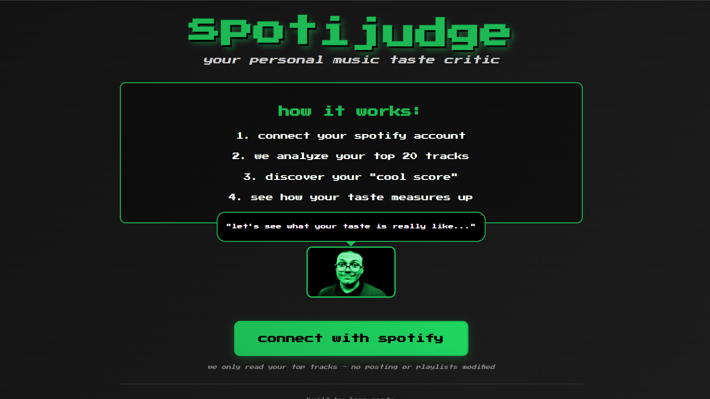
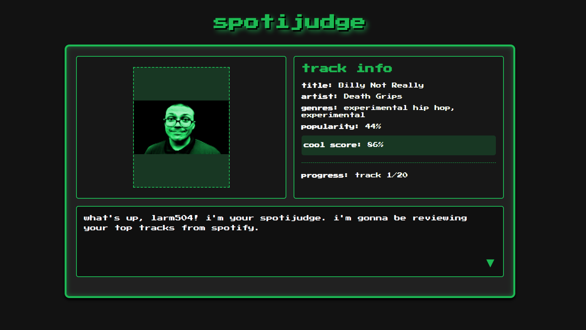
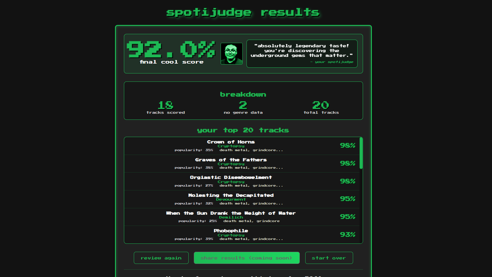

# spotijudge - Your Personal Music Taste Critic

A retro-styled web application that analyzes your Spotify listening habits through the lens of music critic culture. Connect your Spotify account to get your music taste "reviewed" with a custom scoring algorithm that judges your musical choices across multiple factors.

Built with Flask, PostgreSQL, and Docker for a production-ready, scalable architecture.

## Live Demo

**Coming Soon**: `https://spotijudge.onrender.com` (Once deployed, update this link)

## Quick Links

- [GitHub Repository](https://github.com/larsssmoatsss/spotijudge)
- [Deployment Guide](./DEPLOYMENT.md)
- [Spotify Developer Dashboard](https://developer.spotify.com/dashboard)

## Screenshots

### Landing Page


### Review Interface


### Results Page


## Features

- **Spotify OAuth Integration**: Secure authentication with Spotify Web API
- **Advanced Music Analysis**: Multi-factor scoring algorithm analyzing:
  - Genre diversity and "coolness" factor (70+ genres classified)
  - Artist and track popularity metrics
  - Follower count tiers
  - Content explicitness
- **Persistent Data Storage**: PostgreSQL database with full data persistence
- **Containerized Architecture**: Docker and Docker Compose for consistent environments
- **RESTful API**: JSON endpoints for programmatic access to user data
- **Retro Gaming Interface**: Pixel-art inspired UI with interactive dialogue system
- **Three-Page User Flow**: Landing page → Track-by-track reviews → Comprehensive results
- **Suspenseful Experience**: Individual track scores revealed during review, final score saved for dramatic results page
- **Session Management**: Database-backed sessions with user history
- **Custom Visual Elements**: Themed scrollbars, glowing titles, and hover effects
- **Responsive Design**: Works on desktop and mobile devices

## Technologies Used

- **Backend**: Python 3.9+, Flask, SQLAlchemy
- **Database**: PostgreSQL 15 with array and UUID support
- **Containerization**: Docker, Docker Compose
- **Frontend**: HTML5, CSS3, JavaScript
- **API**: Spotify Web API (OAuth 2.0)
- **Configuration**: Environment variables with python-dotenv
- **Styling**: Custom CSS with Google Fonts (Press Start 2P)
- **Development**: Hot reload, health checks, persistent volumes

## How It Works

1. **Authentication**: Users authenticate via Spotify OAuth 2.0
2. **Data Collection**: App fetches user's top 20 tracks and detailed artist information
3. **Database Storage**: All user data, tracks, and artist information cached in PostgreSQL
4. **Track-by-Track Review**: Users cycle through individual tracks with personalized scoring
5. **Scoring Algorithm**: Each track receives a "cool score" based on:
   - **Genre Bonus**: +50 points for "cool" genres (metal, experimental, underground hip-hop, etc.)
   - **Popularity Scaling**: Lower popularity = higher score (rewards discovering underground music)
   - **Artist Followers**: Fewer followers = bonus points (supports smaller artists)
   - **Track Popularity**: Less mainstream tracks score higher
   - **Explicit Content**: +5 point bonus
6. **Results Revelation**: Final page reveals overall score with commentary and complete track breakdown
7. **Persistent Storage**: All analysis sessions saved with ability to view history

## Getting Started

### Prerequisites

- Docker and Docker Compose
- Spotify account (free or premium)
- Spotify Developer App credentials

### Installation

1. **Clone the repository**
   ```bash
   git clone https://github.com/larsssmoatsss/spotijudge.git
   cd spotijudge
   ```

2. **Set up Spotify Developer App**
   - Go to [Spotify Developer Dashboard](https://developer.spotify.com/dashboard)
   - Create a new app
   - Add `http://localhost:5000/callback` to Redirect URIs
   - Note your Client ID and Client Secret

3. **Configure environment variables**
   - Copy `.env.example` to `.env`
   - Fill in your Spotify API credentials:
   ```bash
   cp .env.example .env
   # Edit .env with your actual credentials
   ```

4. **Run with Docker**
   ```bash
   docker-compose up --build
   ```

5. **Open your browser**
   Navigate to `http://localhost:5000`

### Local Development

The application runs in development mode with:
- Hot reload for code changes
- Debug mode enabled
- PostgreSQL with persistent data volumes
- Redis for future session enhancements

## API Endpoints

The application provides RESTful API endpoints for programmatic access:

### User Sessions
- `GET /api/sessions/{session_id}` - Get detailed session data
- `GET /api/users/{user_id}/sessions` - Get all sessions for a user

### Example Response
```json
{
  "id": 1,
  "session_uuid": "550e8400-e29b-41d4-a716-446655440000",
  "final_score": 87.5,
  "total_tracks": 20,
  "scored_tracks": 18,
  "unscored_tracks": 2,
  "created_at": "2025-09-22T17:10:08.000Z",
  "completed_at": "2025-09-22T17:15:30.000Z"
}
```

## Database Schema

### Core Tables
- **users**: Spotify user profiles and metadata
- **analysis_sessions**: Individual analysis runs with scores and statistics
- **artists**: Cached artist data with genres, popularity, and follower counts
- **tracks**: Track information linked to artists
- **track_analyses**: Individual track scores for each session

### Key Features
- **Data persistence**: All user sessions and scores saved permanently
- **Artist caching**: Reduces Spotify API calls by storing artist metadata
- **Session tracking**: Users can review their analysis history
- **Referential integrity**: Proper foreign key relationships and cascading deletes

## Scoring System

The "cool score" algorithm evaluates tracks on multiple criteria:

### Genre Classification
70+ "cool" genres including:
- **Metal variants**: deathcore, black metal, doom metal, mathcore
- **Electronic**: IDM, breakcore, dark ambient, industrial
- **Hip-hop**: experimental hip hop, underground rap, horrorcore
- **Rock/Punk**: post-hardcore, shoegaze, noise rock, math rock
- **Jazz/Soul**: jazz fusion, alternative R&B
- **And many more underground/experimental genres**

### Scoring Breakdown
- **Genre Bonus**: 50 points for tracks in "cool" genres
- **Artist Popularity**: 2-18 points (inverse scale - less popular = more points)
- **Follower Count**: 6-16 points (supports smaller artists)
- **Track Popularity**: 1-11 points (underground tracks favored)
- **Explicit Content**: 5 point bonus
- **Maximum Score**: 100 points per track

## Architecture

### Containerized Services
- **web**: Flask application with SQLAlchemy ORM
- **db**: PostgreSQL 15 with custom initialization
- **redis**: Redis for session storage and caching (optional)

### Development Features
- **Volume mounting**: Live code reloading during development
- **Health checks**: Automatic service dependency management
- **Environment isolation**: Consistent development environments
- **Database persistence**: Data survives container restarts


## Deployment

### Deploying to Render (Recommended)

Render provides free hosting for both the web application and PostgreSQL database.

#### Quick Deploy

1. **Push your code to GitHub** (if not already done)
   ```bash
   git push origin master
   ```

2. **Create a Render Account**
   - Sign up at [render.com](https://render.com)
   - Connect your GitHub account

3. **Set Up Spotify Developer App for Production**
   - Go to [Spotify Developer Dashboard](https://developer.spotify.com/dashboard)
   - Select your app or create a new one
   - Add your Render URL to Redirect URIs: `https://your-app-name.onrender.com/callback`
   - Note your Client ID and Client Secret

4. **Deploy Using Render Blueprint**
   - In Render Dashboard, click "New" → "Blueprint"
   - Connect your GitHub repository
   - Render will automatically detect `render.yaml` and set up:
     - PostgreSQL database
     - Web service with Python runtime
   
5. **Configure Environment Variables**
   After deployment is created, add these environment variables in the Render dashboard:
   - `SPOTIFY_CLIENT_ID`: Your Spotify Client ID
   - `SPOTIFY_CLIENT_SECRET`: Your Spotify Client Secret
   - `SPOTIFY_REDIRECT_URI`: `https://your-app-name.onrender.com/callback`
   - (DATABASE_URL and SECRET_KEY are auto-configured by Render)

6. **Wait for Build & Deploy**
   - Initial build takes 2-3 minutes
   - Your app will be live at `https://your-app-name.onrender.com`

#### Manual Deployment (Alternative)

If you prefer manual setup:

1. **Create PostgreSQL Database**
   - In Render: New → PostgreSQL
   - Name: `spotijudge-db`
   - Free tier is sufficient
   - Save the connection details

2. **Create Web Service**
   - In Render: New → Web Service
   - Connect your GitHub repository
   - Configure:
     - **Name**: `spotijudge`
     - **Runtime**: Python 3
     - **Build Command**: `pip install -r requirements.txt`
     - **Start Command**: `gunicorn app:app`

3. **Set Environment Variables** (same as above)

### Other Deployment Platforms

The application is designed for easy deployment to cloud platforms:

#### Supported Platforms
- **Railway**: Automatic Docker deployment with PostgreSQL addon
- **Heroku**: Container deployment with Heroku Postgres
- **DigitalOcean App Platform**: Docker-based deployment
- **AWS ECS/Fargate**: Container orchestration at scale

### Environment Variables
All configuration via environment variables for 12-factor app compliance.

## Project Structure

```
spotijudge/
│
├── app.py                    # Main Flask application
├── models.py                 # SQLAlchemy database models
├── requirements.txt          # Python dependencies
├── Dockerfile               # Container build instructions
├── docker-compose.yml       # Multi-service orchestration
├── .env.example             # Environment variable template
│
├── database/
│   └── init.sql             # PostgreSQL initialization
│
├── static/
│   ├── styles.css           # Complete UI styling
│   ├── script.js            # Frontend interactivity
│   └── images/              # Screenshots and assets
│
└── templates/
    ├── landing.html         # Landing page
    ├── index.html           # Review interface
    └── results.html         # Results page
```

## Technical Highlights

### OAuth Implementation
- Complete Spotify OAuth 2.0 flow with secure token exchange
- Proper scope handling for user data access
- Environment-based credential management

### Database Architecture
- PostgreSQL with advanced features (arrays, UUIDs, triggers)
- Efficient artist metadata caching to reduce API calls
- Proper indexing for query performance
- Data integrity with foreign key constraints

### Containerization
- Multi-stage Docker builds for optimized images
- Docker Compose orchestration with health checks
- Development and production configurations
- Persistent data volumes

### API Design
- RESTful endpoints following standard conventions
- JSON responses with proper HTTP status codes
- Structured error handling and validation

## Contributing

This is a personal learning project showcasing full-stack development skills. The codebase demonstrates:

- **Backend Development**: Flask, SQLAlchemy, PostgreSQL
- **Frontend Development**: Responsive design, interactive UI
- **DevOps**: Docker containerization, environment management
- **API Development**: RESTful design, OAuth integration
- **Database Design**: Relational modeling, performance optimization

## License

This project is open source and available under the [MIT License](https://opensource.org/license/mit).

---

**Built by Lars Moats** | *Demonstrating production-ready full-stack development with modern DevOps practices*

*Connect with me on [LinkedIn](https://www.linkedin.com/in/larsmoats/)*