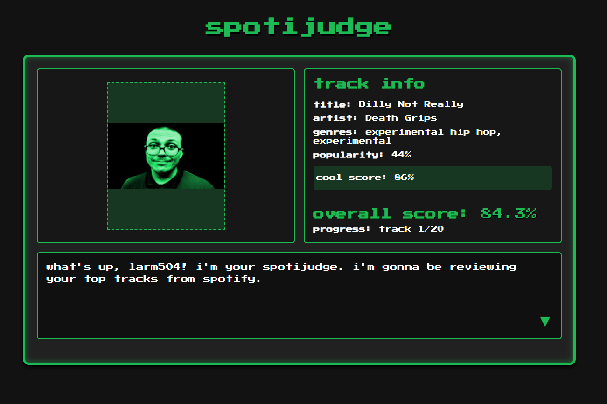

# spotijudge - Your Personal Music Taste Critic

A retro-styled web application that analyzes your Spotify listening habits through the lens of Anthony Fantano (theneedledrop). Connect your Spotify account to get your music taste "reviewed" with a custom scoring algorithm that judges your musical choices across multiple factors.



## Features

- **Spotify OAuth Integration**: Secure authentication with Spotify Web API
- **Advanced Music Analysis**: Multi-factor scoring algorithm analyzing:
  - Genre diversity and "coolness" factor (70+ genres classified)
  - Artist and track popularity metrics
  - Follower count tiers
  - Content explicitness
- **Retro Gaming Interface**: Pixel-art inspired UI with interactive dialogue system
- **Real-time Track Reviews**: Cycle through your top 20 tracks with individual scoring
- **Session-based Navigation**: Persistent state management for seamless browsing
- **Responsive Design**: Works on desktop and mobile devices

## Technologies Used

- **Backend**: Python 3.7+, Flask
- **Frontend**: HTML5, CSS3, JavaScript
- **API**: Spotify Web API (OAuth 2.0)
- **Styling**: Custom CSS with Google Fonts (Press Start 2P)
- **Session Management**: Flask sessions for state persistence

## How It Works

1. **Authentication**: Users authenticate via Spotify OAuth
2. **Data Collection**: App fetches user's top 20 tracks and detailed artist information
3. **Scoring Algorithm**: Each track receives a "cool score" based on:
   - **Genre Bonus**: +50 points for "cool" genres (metal, experimental, underground hip-hop, etc.)
   - **Popularity Scaling**: Lower popularity = higher score (rewards discovering underground music)
   - **Artist Followers**: Fewer followers = bonus points (supports smaller artists)
   - **Track Popularity**: Less mainstream tracks score higher
   - **Explicit Content**: +5 point bonus
4. **Interactive Review**: Navigate through tracks with Fantano-inspired commentary
5. **Overall Score**: Calculate average "coolness" across all tracks

## Getting Started

### Prerequisites

- Python 3.7 or higher
- Spotify account (free or premium)
- Spotify Developer App credentials

### Installation

1. **Clone the repository**
   ```bash
   git clone https://github.com/larsssmoatsss/spotijudge.git
   cd spotijudge
   ```

2. **Install dependencies**
   ```bash
   pip install -r requirements.txt
   ```

3. **Set up Spotify Developer App**
   - Go to [Spotify Developer Dashboard](https://developer.spotify.com/dashboard)
   - Create a new app
   - Add `http://localhost:5000/callback` to Redirect URIs
   - Note your Client ID and Client Secret

4. **Configure credentials**
   - Copy `config.example.json` to `config.json`
   - Fill in your Spotify API credentials:
   ```json
   {
       "SPOTIFY_CLIENT_ID": "your_client_id_here",
       "SPOTIFY_CLIENT_SECRET": "your_client_secret_here", 
       "SPOTIFY_REDIRECT_URI": "http://localhost:5000/callback"
   }
   ```

5. **Run the application**
   ```bash
   python app.py
   ```

6. **Open your browser**
   Navigate to `http://localhost:5000`

## Scoring System

The "cool score" algorithm evaluates tracks on multiple criteria:

### Genre Classification
70+ "cool" genres including:
- **Metal variants**: deathcore, black metal, doom metal, mathcore
- **Electronic**: IDM, breakcore, dark ambient, industrial
- **Hip-hop**: experimental hip hop, underground rap, horrorcore
- **Rock/Punk**: post-hardcore, shoegaze, noise rock, math rock
- **Jazz/Soul**: jazz fusion, alternative R&B
- **And many more underground/experimental genres**

### Scoring Breakdown
- **Genre Bonus**: 50 points for tracks in "cool" genres
- **Artist Popularity**: 2-18 points (inverse scale - less popular = more points)
- **Follower Count**: 6-16 points (supports smaller artists)
- **Track Popularity**: 1-11 points (underground tracks favored)
- **Explicit Content**: 5 point bonus
- **Maximum Score**: 100 points per track

## Design Features

- **Retro Gaming Aesthetic**: Inspired by classic RPG dialogue systems
- **Custom Character**: Green-tinted Anthony Fantano sprite
- **Interactive Elements**: Clickable dialogue progression with hover effects
- **Responsive Grid Layout**: Adapts to different screen sizes
- **Typography**: Press Start 2P font for authentic retro feel
- **Color Scheme**: Dark theme with Spotify green accents (#1db954)

## Project Structure

```
spotijudge/
│
├── app.py                    # Main Flask application and scoring logic
├── config.json              # Spotify API credentials (gitignored)
├── config.example.json      # Configuration template
├── requirements.txt         # Python dependencies
├── .gitignore              # Git ignore rules
│
├── static/
│   ├── styles.css          # Complete UI styling
│   ├── script.js           # Frontend interactivity
│   └── images/
│       └── fantanogreen.png # Temporary character sprite (lol)
│       └── spotijudge_screenshot.png # Dev screenshot
│
└──  templates/
    └── index.html          # Main application interface
```

## Technical Highlights

### OAuth Implementation
- Complete Spotify OAuth 2.0 flow
- Secure token exchange and session management
- Proper scope handling for user data access

### Data Processing
- Multiple API calls for comprehensive user analysis
- Artist metadata aggregation and caching
- Complex scoring algorithm with weighted factors

### Frontend Architecture
- Session-based state management
- Interactive UI with smooth navigation
- Responsive design principles

## 🔮 Future Enhancements

- [ ] Add playlist generation based on scoring recommendations
- [ ] Implement user comparison features ("whose taste is cooler?")
- [ ] Add detailed analytics and visualization charts
- [ ] Create shareable results with social media integration
- [ ] Expand genre classification system
- [ ] Add audio preview integration
- [ ] Implement user accounts and score history
- [ ] Deploy as a public web application

## 📝 What I Learned

- **Full-stack Development**: End-to-end web application creation with Flask
- **API Authentication**: OAuth 2.0 implementation and security best practices
- **Data Analysis**: Creating meaningful metrics from raw API data
- **Algorithm Development**: Designing scoring systems with multiple weighted variables
- **UI/UX Design**: Building engaging, themed user interfaces
- **Session Management**: Handling user state across HTTP requests

## 🤝 Contributing

This is a personal learning project showcasing full-stack development skills. Feedback and suggestions are welcome! Feel free to open an issue or submit a pull request.

## 📄 License

This project is open source and available under the [MIT License](LICENSE).

---

**Built with 🎵 by Lars Moats** | *Demonstrating full-stack development, API integration, and creative, fun algorithm design*

*Connect with me on [LinkedIn](https://www.linkedin.com/in/larsmoats/)*